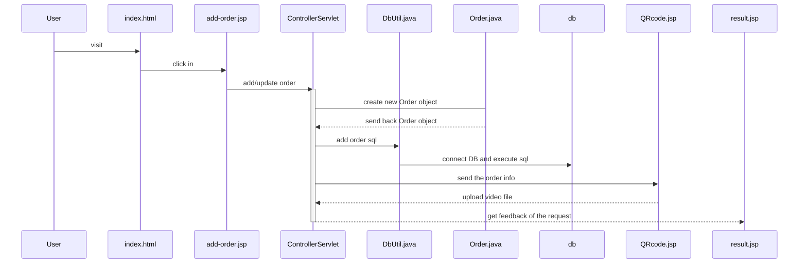
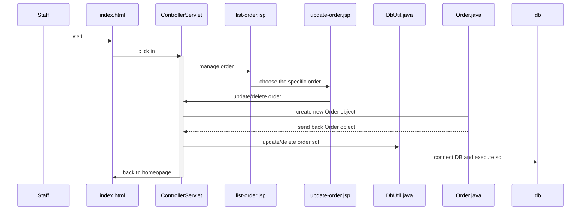

# PackAudio ReadMe(寄信●寄心)
PackAudio is a `JDBC web application` for one of elective subject. Here is the detail of the course infomation:
- school: Tsing-Hua University
- course id: 10720IEEM214000
- name: Programming Design and Applications
- lecturer: Dr. GOVINDARAJAN USHARANI HAREESH

## Functionality
- Bilingual interface
- Store and exchange data using MySQL
- Automatic build a QR code for each request
- Upload file and keep it in the specific directory

## Introduction
According to the big data competition hosted by Chunghua Post Office in Taiwan in 2019, we choose Chunghua Post Office as our target and deliver a proposal for innovative postal service. We called it "PackAudio"! You can send packages/letters along with the video/audio you want to show to the recipient. It means that you can not only send packages to someone, but also share your feelings at the moment the recipent got your items. 

## How PackAudio works?
Imaging you are sending a gift to your family, friends, lover etc, sometimes our emotion is beyond words. The card or phone call cannot show all of our feelings toward the recipient. Therefore, if you can make a video in advance. We, PackAudio team, can show the video and the gift or something to the targeted person, and make your feelings/emotion (affectionateness, thankfulness and so on) delivery in time.

## Why we come up with this idea?
Nowadays, people pursue the efficiency but ignore the rudimentary relationship with people. PackAudio is trying to improve the problem by launching a build-up system over ChungHua Post Delivering Service.

## Visuals


## Installation
#### The environment for our project
- IDE: `Eclipse IDE for Java EE Developers 2019-03`
- database: `MySql 8.0.15`
- java: `jre 1.8.0_18.1`
- server: `Apache Tomcat v9.0`

#### The external jar file we need
- `servlet-api.jar`
- `core-3.2.1.jar`
- `javax.servlet.jsp.jstl-1.2.1.jar`
- `javax.servlet.jsp.jstl-api-1.2.1.jar`
- `mysql-connector-java-8.0.11.jar`

#### The project structure looks like

## Procedure Demonstration
### add order

### manage order

## Authors
- 黃提道 HUANG, TI-DAO
- 陳柏言 CHEN, PO-YEN
- 郭則儀 KUO, TSE-YI
- 林佳蒨 LIN, CHIA-CHIEN

## Support
#### The jsp/Servlet structure we learned from
The source we learned is from [here](https://www.udemy.com/jsp-tutorial/) /*not for free*/
Here is the detail of the course information:
- soure: udemy
- course name: JSP, Servlets and JDBC for Beginners: Build a Database App
- lecturer: Chad Darby

Or you can find some jsp tutorial from [here](https://www.youtube.com/playlist?list=PLEAQNNR8IlB588DQvb2wbKFQh2DviPApl) for free!!

#### The html tamplate we use
Our website template is named `Cardio`. It is a one page website template made by PHIr exclusively for Codrops.
You can find more detail from [here](https://www.free-css.com/free-css-templates/page238/cardio?fbclid=IwAR2CEEVV5B6LD02pb5j4rRm2BFjM0HFS6XqUTdV4c6Ocm08fv1IQN93K7Bg).

#### Java tutorial
- [菜鳥教程RUNOOB](http://www.runoob.com/java/java-tutorial.html)

#### Web tutorial
- [W3school](https://www.w3schools.com/)

